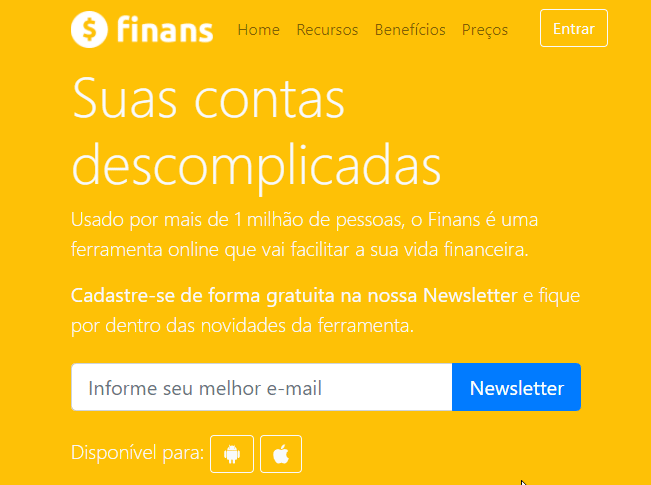

# Finans
> Uma aplicação em PHP capaz de enviar e-mails.

Este projeto é uma aplicação web capaz de autenticar usuários em um sistema de Helpdesk. Os usuários de nível comum conseguem adicionar e consultar chamados (apenas os feitos por ele mesmo) e usuários de nível técnico conseguem ver todos os chamados registrados no sistema.

## Exibição - Enviando e-mail

Por meio da biblioteca ***PHPMailer***, ao preencher o campo "informe seu melhor e-mail" e clicar em "Newsletter" o usuário envia o dado preenchido em uma mensagem de e-mail (via back-end).



Caso bem sucedida, a operação retorna ao usuário um feedback positivo, entretanto, caso o usuário não preencha o campo e tente fazer o envio, a aplicação retorna um feedback informando que o campo deve ser preenchido. **Outras visualizações da aplicação:**


Para executar o projeto localmente o repositório deve ser clonado da forma desejada:
```
$ git clone https://github.com/finans.git
```

## Histórico de atualização 

* 0.0.1;
    * Lançamento inicial.

## Meta 

Jonathan Douglas Nunes de Souza - [@jonathansouza] - <jonathannunes.souza98@gmail.com>

Distribuido sob licença. Veja **`LICENÇA`** para mais informações.

[https://github.com/jonathannunesdsouza/jonathannunesdsouza.github.io]